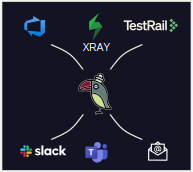

<h1 align="center"> 

  <p>
    <a href="https://www.npmjs.com/package/@qytera/pass-parrot">
      
    </a>
    <a href="https://www.npmjs.com/package/@qytera/pass-parrot">
      
    </a>
    <a href="https://github.com/Qytera-Gmbh/pass-parrot/issues?q=is%3Aissue+is%3Aopen">
      
    </a>
    <a href="https://github.com/Qytera-Gmbh/pass-parrot/issues?q=is%3Aissue+is%3Aopen+no%3Aassignee">
      
    </a>
  </p>
</h1>

# Pass Parrot

A flexible and extensible tool for aggregating test results and forwarding them to various destinations, such as HTML reports, Microsoft Teams or Slack. Designed to bridge the gap between testers and management.



Planned features:

- Xray test results aggregation
- Microsoft Teams integration
- Slack integration
- HTML output
- Email integration

> [!WARNING]
> The tool is at a very early stage of development and may frequently introduce breaking changes.

# Installation

```bash
npm install @qytera/pass-parrot
```

# Usage

TBD
